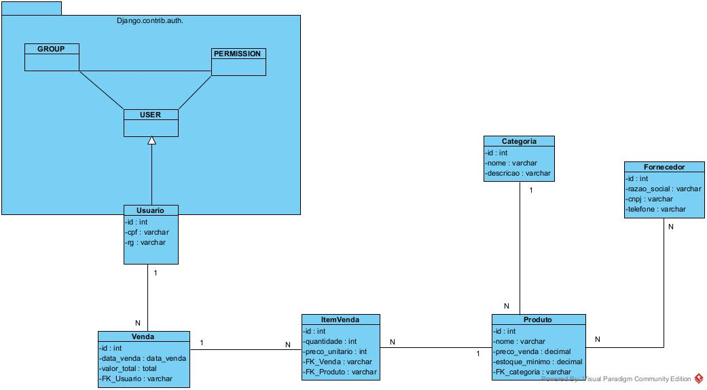

# Sistema de Gestão de Mercadinho (Boi na Brasa)

Trabalho final de Práticas de Software Web II (PSW II), desenvolvido em dupla com Django.

**Integrantes:**
- Ágata Cristini (GitHub: [agatamartins](https://github.com/agatamartins))
- Marlon Breno (GitHub: [navarro132006](https://github.com/navarro132006))

> Observação sobre o histórico do Git: os commits aparecem com mais de um nome
> (agatamartins, Marlon Breno, Navarro Breno e navarro132006). Os três últimos
> correspondem ao mesmo integrante, Marlon Breno, em máquinas com configurações
> de Git diferentes.

## Módulos (CRUDs completos com visão detalhada)

Usuários, Fornecedores, Categorias, Produtos e Vendas.

## Diagrama de Classes



## Requisitos

- Python 3.12 ou superior
- Git

## Como executar

```bash
# 1. Clonar o repositório
git clone https://github.com/agatamartins/projeto-final-psw2.git
cd projeto-final-psw2

# 2. Criar e ativar o ambiente virtual
python -m venv venv
# Windows (PowerShell):
venv\Scripts\Activate.ps1
# Linux/macOS:
source venv/bin/activate

# 3. Instalar as dependências
pip install -r requirements.txt

# 4. Criar o banco e os grupos de permissão
python manage.py migrate

# 5. Criar o superusuário inicial
python manage.py createsuperuser

# 6. Rodar o servidor
python manage.py runserver
```

Acesse http://127.0.0.1:8000

## Autenticação e permissões

O controle de acesso usa `django.contrib.auth` (login, logout, `@login_required` e
`@permission_required`). Os grupos abaixo são criados automaticamente ao rodar o
`migrate`. Ao cadastrar um usuário, escolhe-se o grupo e ele já recebe as
permissões correspondentes, sem precisar passar pelo admin.

| Grupo | Permissões |
|---|---|
| Gerente | Todas: usuários, fornecedores, categorias, produtos e vendas |
| Estoquista | Produtos, categorias e fornecedores (CRUD); vendas somente leitura |
| Vendedor | Criar e ver vendas; produtos e categorias somente leitura |

O superusuário criado no passo 5 tem acesso total. Para testar os grupos, crie
usuários em `/usuarios/criar/` escolhendo cada grupo.

## Tecnologias

Django, Bootstrap 5 e SQLite. Todas as views são Function-Based Views.

## Créditos

O front-end usa Bootstrap 5.3.8 e Bootstrap Icons